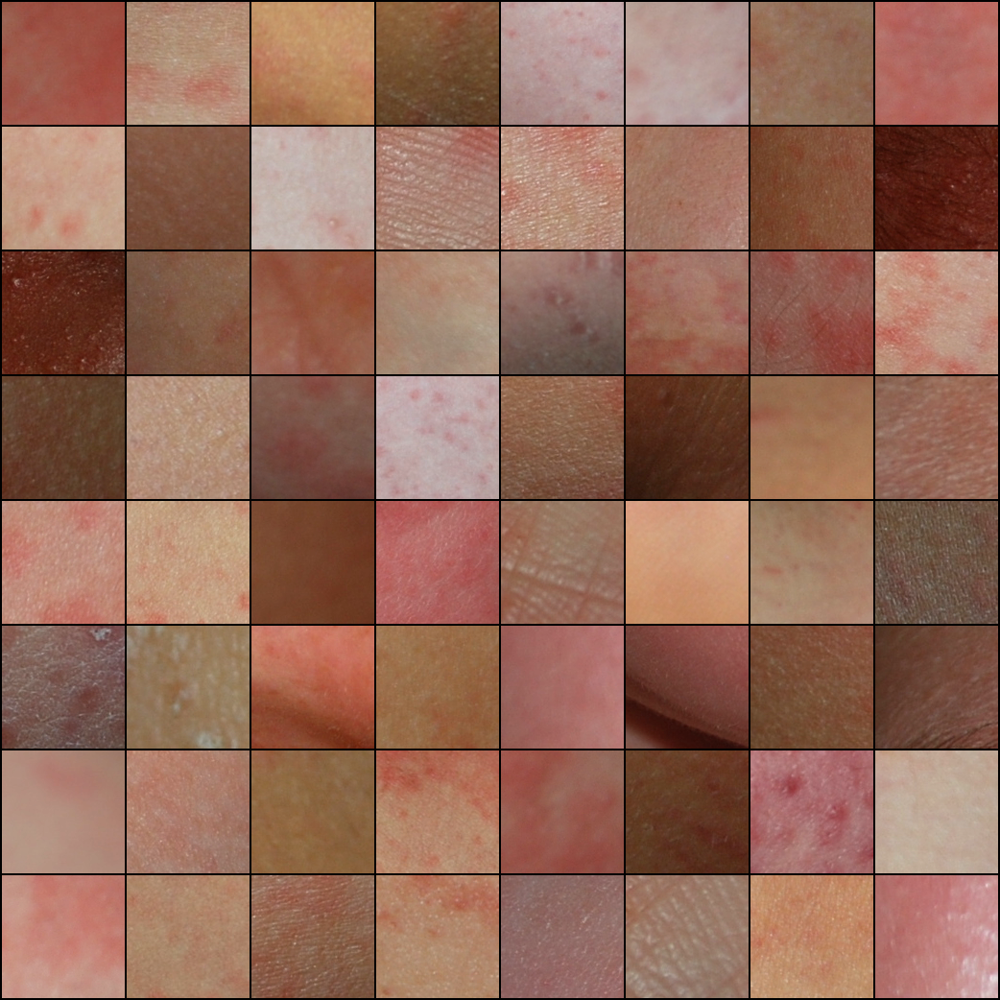
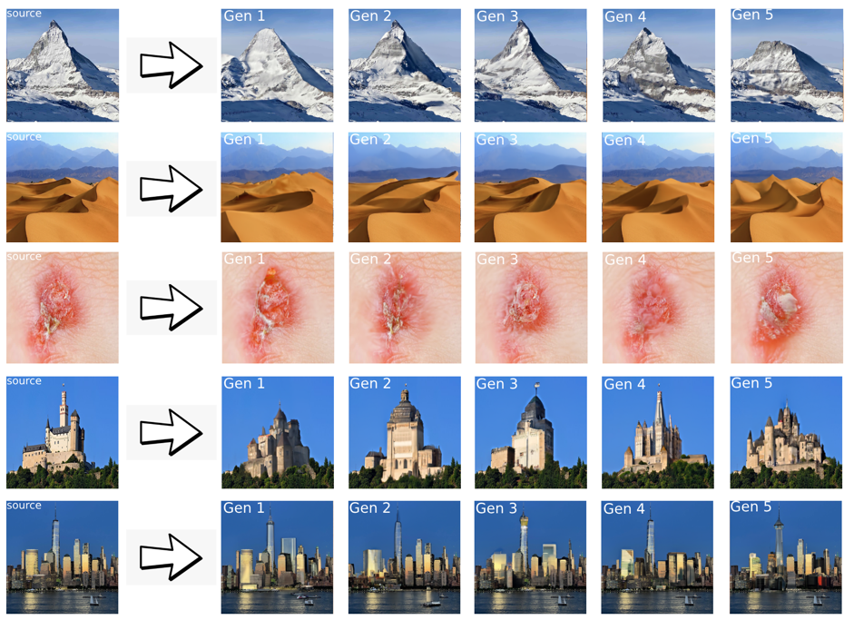
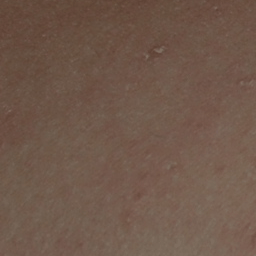

# Skin Disease Image Generation
Riccardo Murgia 

## Purpose
Generate synthetic images of skin illnesses to augment datasets for training skin illness detectors. The dataset is acquired from Italian hospitals, capturing images "in the wild" in an amateur fashion. Our focus is on esantema maculo-papuloso, and crops are extracted from larger original images, each of dimension 256x256, accompanied by a binary mask to isolate ill skin areas.

## Dataset
The dataset (**not included**) obtained from Italian hospitals, contains images captured in an amateur fashion. It includes 9 types of skin illnesses, but our focus is on esantema maculo-papuloso. Crops are extracted, each of size 256x256, with accompanying binary masks for ill skin areas.

## Models
### Previous Models
- DermGAN: A conditional Pix2Pix-based GAN, which uses colored masks as input. The output tends to be unsatisfying, resembling a simple gaussian blur.
- DermDiff: A diffusion model that utilizes colored masks, producing better results than DermGAN but lacks full realism.

### Models in This Work
- DCGAN: A baseline model with simplicity for resource efficiency and ease of tuning, avoiding the use of masks.
- CVAE: Another baseline model addressing the limitations of variational autoencoders.
- GLIDE: An iterative inpainting model that takes an original source image and creates multiple outputs through masking and inpainting iteratively.

### Limitations of Previous Approaches
Usage of masks: Binary masks, while useful for downstream tasks, can be inaccurate and limit dataset flexibility.
Baselines: DCGAN and CVAE are built as simpler models, avoiding the need for masks, but their training (reported in the included notebooks) has shown to be not satisfactory for larger resolutions.

## GLIDE Algorithm

Iterative Inpainting with GLIDE: GLIDE is a [model from OpenAI](https://github.com/openai/glide-text2im) which runs on an original source image, performing iterative masking and inpainting. Each step of this model really involves 100 diffusion steps.

## Our results

### Advantages and limitations
- GLIDE doesn't need any pretraining and can be run in platforms like Colab
- GLIDE Mask Maintenance: Maintaining hand-labeled segmentation masks is challenging, but information about edited areas is retained.
- GLIDE resource requirement: model size is not exaggerated (we use the fast27 version) but other options may yield better results with less blurring.
- GLIDE Processing time: On an A100, a single run takes ~8 seconds, making it feasible for smaller datasets. Larger datasets may require a cluster of A100, focusing on underrepresented classes.
Limitations and Future Steps: Addressing limitations and proposing future steps, including augmentation for diverse skin groups and cost evaluations.
